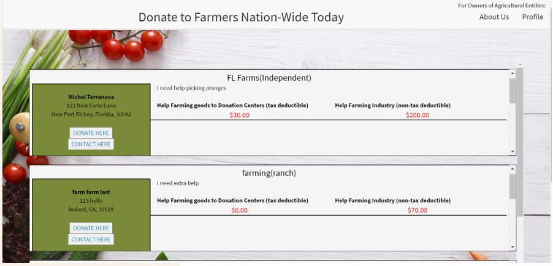
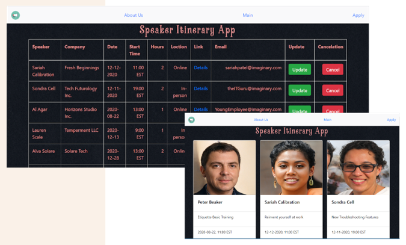
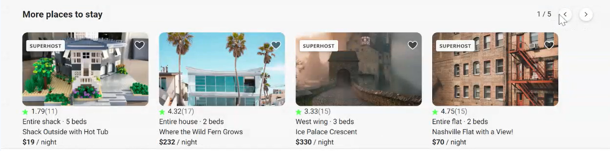

# Junior Full Stack Web Developer
<link rel="stylesheet" type="text/css" media="all" href="public/css/style.css" />

----------------------------------- 
## About Me

<i>Full-stack web developer in both Java and MERN stacks whose educational background is in science and animation. This has given me the perfect foundation for innovation and function.</i>

-----------------------------------
### Education
- Georgia Institute of Technology, *Certificate Full-Stack Web Development*,  Atlanta, GA   
- Savannah College of Art and Design,  *MA in Animation*,  Savannah, GA  
- Florida State University,  *BS Geology & BA Studio Art*,  Tallahassee, FL 

-----------------------------------

### Work Experience

__IT Experience__ : 1 Year

__Overall Experience__: 4 Years

-----------------------------------

### Hobbies | Passions

- Reading
- Animation/Drawing
- Tennis

-----------------------------------

### Contact Information 
For all information, please contact Kiersten Kindred at Talent Path.

- __Phone Number__ : 713-547-4495 
- __Email Address__ : [kkindred@talentpath.com](mailto:kkindred@talentpath.com)
- __LinkedIn Account__ : [Click Link Here](https://www.linkedin.com/in/michal-terranova-435a55b4)
- __GitHub Account__ : [github.com/mrterranova](https://github.com/mrterranova)
- __Twitter Account__ : [Click Link Here](https://twitter.com/FullTerranova) 

-------------------------------------

## Skills

### Software Engineering Skills
    Git | Github | Gitlab
    HTML
    CSS
    Agile Environment| Scrum | Kanban
    JavaScript Fundamentals: OOP, Modern ES6 Features, & Web Components
    React | Redux
    MongoDB/Mongoose
    MERN Full Stack Architecture (MongoDB, Express, React, Node) Stack
    Java /Spring Boot
    MySQL/PostgreSQL/Sequelize

### Additional Strengths
    Firebase
    Exposure to Express-Handlebars
    Leadership
    Bootstrap
    Heroku | GPC Training | AWS Training
    Certificate in Object Oriented Programming in Java
    Teamwork & Collaboration
    Technical Written & Verbal Communication Skills

-------------------------------------

## Talent Path Project Work

#### National Farm Donator 

Independent full-stack CRUD application to serve as a template for communication between farmers and community using PassportJS and a sequelize.

    Languages : Javascript, Node.js/Express, MySQL 
    
Project Link: [Capstone Repository](https://github.com/mrterranova/capstoneTalentPath)

#### Speaker Itinerary App 
Independent full-stack CRUD application for displaying speakers and scheduling speaking events.

    Languages: AngularJS, Springboot/Java, SQLite
    
Project Link: [Client Repository](https://github.com/mrterranova/SpringBootSpeakers-client), [Server Repository](https://github.com/mrterranova/SpringBootSpeakers-Server)
#### Headshots 
Group ReactJS application with camera and background removal components to take professional pictures.

    Languages: ReactJS
    Roles: Styling and Toggle Features
    
Project Link:[Headshots Application](https://github.com/mrterranova/headShotsSiteforTP)

#### Amazin'  
Full-stack application replicating popular shopping websites. 

    Languages: ReactJS, Springboot/Java, Postgres
    Roles: Product Variant Component, Editing Server Development
    
Project Link:[Client Repo](https://github.com/mrterranova/client-Amazin), [Server Repo](https://github.com/mrterranova/server-Amazin)

#### Earth BNB 
Full-stack application replicating popular bed and breakfast websites.

    Languages: AngularJS, Springboot/Java, MySQL
    Roles: More Places to Stay Component, Footer, Client Routing, Server Development
    
Project Link: [Client Repo](https://github.com/mrterranova/client-EarthBnB), [Server Repo](https://github.com/mrterranova/server-EarthBnB)

#### Learning Exercises with Java Projects 
Java building exercises demonstrating knowledge base in Java testing and application production. 

Projects and Links: 
* [Mini Arcade Repository](https://github.com/mrterranova/maven_simple-arcade)| [Travis Build](https://travis-ci.com/github/mrterranova/maven_simple-arcade)
* [Streams and Lambdas Repository](https://github.com/mrterranova/maven_streams-and-lambdas)| [Travis Build](https://travis-ci.com/github/mrterranova/maven_streams-and-lambdas)
* [Bin and Die Repository](https://github.com/mrterranova/Maven.BinAndDieSimulation) | [Travis Build](https://travis-ci.com/github/mrterranova/Maven.BinAndDieSimulation)
* [Learner Lab Repository](https://github.com/mrterranova/maven_learnerlab)| [Travis Build](https://travis-ci.com/github/mrterranova/maven_learnerlab)
* [Exceptions Exercises Repository](https://github.com/mrterranova/maven.exceptional-phone-number) | [Travis Build](https://travis-ci.com/github/mrterranova/maven.exceptional-phone-number)
* [Java Core Foundations 3 (Extra)](https://github.com/mrterranova/maven.stringarrayutilities)|[Travis Build](https://travis-ci.com/github/mrterranova/maven.stringarrayutilities)
* [Java Core Foundations 2](https://github.com/mrterranova/maven.numbers-triangles-tables)| [Travis Build](https://travis-ci.com/github/mrterranova/maven.numbers-triangles-tables)
* [Java Core Foundations 1](https://github.com/mrterranova/maven.java-fundamentals)| [Travis Build](https://travis-ci.com/github/mrterranova/maven.java-fundamentals)

-----------------------------------

### Authored Articles

##### [Mapping out your full-stack project: what goes on behind the code](https://medium.com/@mterranova_33000/sketching-out-your-code-d917c59519c8)

In this post, you won’t find a single line of code. That’s correct, no code at all because you as a developer need a plan for your full-stack application first...

##### [React from scratch: What your webpack might require with .jsx extensions, css, jest-testing, and react-router](https://medium.com/@mterranova_33000/react-from-scratch-what-your-webpack-might-reaquire-from-with-jsx-872373b10715)

Building a react app from scratch? Many tutorials will give you insight as to how to build your own react project from scratch. This tutorial includes not only the basics of what you will need but goes into features that you or your team might want to include...

##### [Build your own custom dropdown menu that displays the user’s selection on click in ReactJS without framework plugins](https://medium.com/@mterranova_33000/build-your-own-custom-dropdown-menu-in-reactjs-f7b69c4658b3)

This is a step-by-step guide on how to build a customizable dropdown menu that updates the options your menu on click. You will be given all the needed steps to develop your dropdown without any plugins...

    
